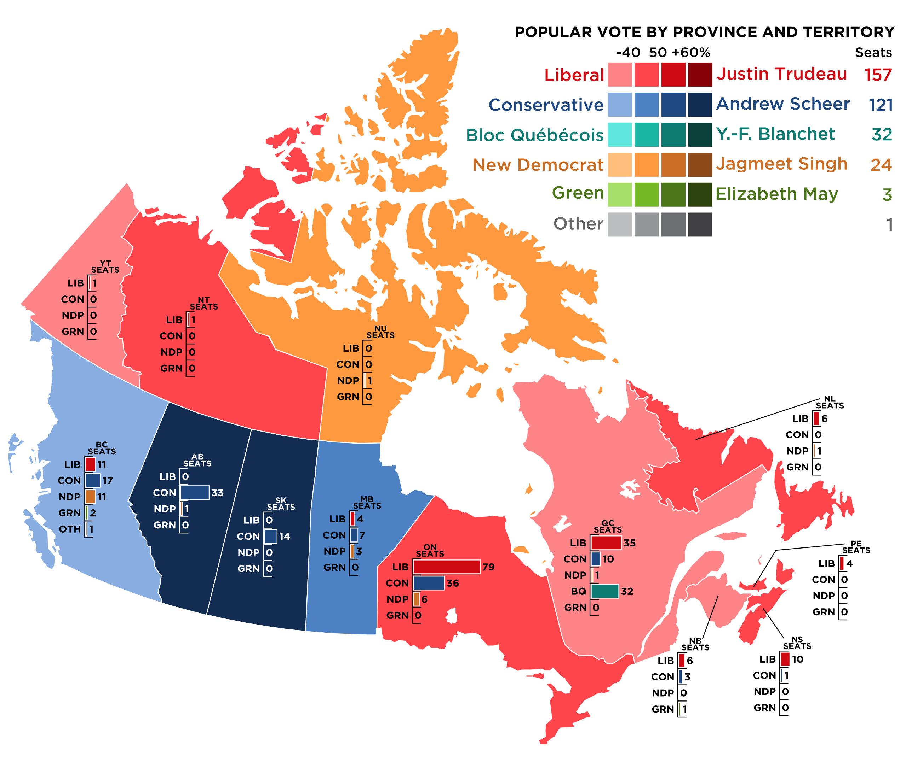
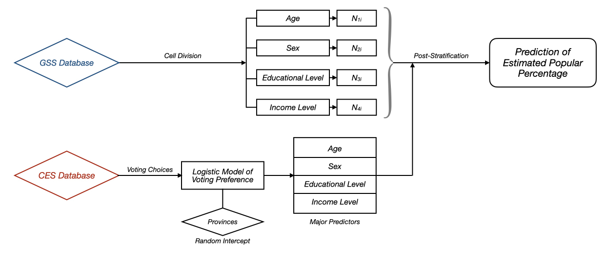

<style type="text/css">

h1.title {
  font-size: 38px;
  color: Black;
  text-align: center;
}
h4.author { 
    font-size: 18px;
  color: Black;
  text-align: center;
}
h4.date { 
  font-size: 18px;
  color: Black;
  text-align: center;
}
</style>

\newpage
# Abstract

Federal Election is always one of the biggest and most important events in a country. As the 2019 Canadian Federal Election has ended for almost a year now, the fact that a large proportion of citizens were not able to votes in the 2019 election evokes the hypothesis of a potential completely different results should everyone had voted then. This report utilized Multilevel Regression Post-stratification technique, along with logistic modeling and random intercept modeling to predict the potential different election results based off 2019 Canadian Election Study data and General Social Survey (GSS) on Canadians at Work and Home in 2016 data. The report successfully predicts that even though every single citizen could have voted in 2019 Canadian Federal Election, the popular voting result was still less likely to change, although support rate for minor parties could increase, but not for major parties.

    
        
**Keywords**: Canadian Federal Election, Logistic model, Multilevel Regression Post-Stratification, Canadian Election Study, General Social Survey


```{r , echo=FALSE, include=FALSE, message=FALSE, warning=FALSE}
library(tidyverse)
library(knitr)
library(cesR)
library(labelled)
library(kableExtra)
library(janitor)
library(lme4)
library(ggpubr)

# Loading in the cleaned survey Data

survey_raw <- read_csv("surveydata.csv")

# Loading in the cleaned census Data
#census_data <- read_csv("~/Desktop/STA304/STA304-PS3/census_data.csv")

```

\newpage

# Introduction

Voting and elections are the most basic elements of democracy. The 2019 Canadian federal election (formally the 43rd Canadian general election) was held on October 21, 2019, to elect members of the House of Commons to the 43rd Canadian Parliament. The writs of election for the 2019 election were issued by Governor General Julie Payette on September 11, 2019 [1]. The results were exciting and competition was fierce. Although once again, Liberal party has taken charge of the government, however, not without cost. The election results are demonstrate in Table 1 below:

```{r , echo=FALSE, include=TRUE, message=FALSE, warning=FALSE}

df_2019 <- read_csv("2019_data.csv")
df_2019_table <- cbind(df_2019$Party, 
                       df_2019$`Party Leader`, 
                       df_2019$`Seats Won`, 
                       df_2019$`Popular Votes`,
                       df_2019$`Popular Percentage`)
df_2019_table %>% 
    kbl(caption = "2019 Canadian Election Results",
        align = 'c', 
        col.names = c("Party Name", "Party Leader", "Seats Won", "Popular Votes", "Popular Percentage"),
        booktabs = T) %>% 
    kable_styling(full_width = F, 
                  html_font = "Cambria", 
                  latex_options = c("striped", "hold_position"),
                  position = "center")

```

And the visualized results separated by provinces is shown as below:

{#id .class width=55% height=55%}

Liberal party held 157 seats and won the election, however, it lost the competition of popular voting to the Conservative party. Compared to the overwhelming success of Liberal party in 2015, it was such a close one in the 2019 election. Political reasons are not the focus of this report, but the total number of voters seems far less than the number of Canadian citizens. 

By roughly calculating the popular voting numbers, there were only approximately 16 millions of voters that had voted in 2019, compared to approximately 36 millions of citizens across Canada, according to 2016 census [2]. Although in reality, it is not possible for every citizen over 18 years old to vote for the election, due to restrictions in numerous aspects, the proportion of citizens that had voted in 2019 was still lower than expected. Nevertheless, is it possible that the election results could be different if EVERYONE had voted in 2019 Canadian Federal Election, especially the popular votes percentage for each party? What aspects can contribute to the outcome of whether a voter would vote for a certain party?

To study this problem, this report will review the 2019 Canadian Federal Election results using CES data and by assuming every qualified Canadian citizen could have voted, to use post-stratification technique based on General Social Survey data from 2016 to estimate whether the results might be different if 'everyone' had voted in 2019.

This report will include four major parts:

1. Data Introduction and Exploring, in which original CES survey data will be visualized to explore several characteristics in preparation of further analysis; 

2. Model Specifications, in which mathematical and statistical models that have been used in this report will be specified, explained, and evaluated;

3. Results, in which estimated results from models and post-stratification technique will be demonstrated and compared to the actual election results, as well as discoveries from model exploration;

4. Discussion, in which the results will be evaluated, along with the weaknesses of this analysis and potential future directions to make this analysis better

# Data Introduction and Exploring

Throughout its long history, the CES has been a rich source of data on Canadians' political behaviour and attitudes, measuring preferences on key political issues such as free trade with the US, social spending and Quebec’s place in Canada; political actors, such as parties, party leaders and the government; and social concerns, such as women’s place in the home, support for immigration, and attitudes toward gays and lesbians; as well as political preferences and engagement. These data provide an unparalleled snapshot and record of Canadian society and political life [3]. The multifaceted data from CES dataset makes a perfect survey sample to investigate which aspects or characteristics of voters would affect the decision of voting for a certain party. 

General Social Survey (GSS) on Canadians at Work and Home in 2016, which is a sample survey with cross-sectional design and conducted from August 2nd to December 23rd 2016. The target population includes all non-institutionalized persons 15 years of age and older, living in the 10 provinces of Canada. This survey aimed at taking a comprehensive look at the way Canadians live by incorporating the realms of work, home, leisure, and overall well-being, and thus knowing more about the lifestyle behaviors of Canadians that impact their health and well-being both in the workplace and at home [4]. The multi-diversity and detailed information of each individual involved in this survey makes it a good source for data post-stratification. Both data are observational data, meaning the data were collected based on random selection upon observations rather than a fully experimental data collection and introducing a systemetic intervention to study any effects.

The 2019 CES data have quite a lot of predictors, a few of which are considered important to this analysis are: province of residence, sex, age, education background, income, vote choice, and satisfaction towards government. The full data demonstration is attached to the Appendix page. The voting choices of survey participants are demonstrated below:

```{r , echo=FALSE, include=TRUE, message=FALSE, warning=FALSE, fig.align='center'}


survey_df <- survey_raw %>% 
  rename(province = cps19_province) %>% 
  mutate(income_level = case_when(
    cps19_income_number < 25000 ~ "Less than $25,000",
    cps19_income_number < 50000 ~ "$25,000 to $49,999",
    cps19_income_number < 75000 ~ "$50,000 to $74,999",
    cps19_income_number < 100000 ~ "$75,000 to $99,999",
    cps19_income_number < 125000 ~ "$100,000 to $124,999",
    cps19_income_number > 125000 ~ "$125,000 or more"
    )) %>% 
  mutate(income = case_when(
    cps19_income_number < 25000 ~ 0,
    cps19_income_number < 50000 ~ 1,
    cps19_income_number < 75000 ~ 2,
    cps19_income_number < 100000 ~ 3,
    cps19_income_number < 125000 ~ 4,
    cps19_income_number > 125000 ~ 5
    )) %>%
  mutate(age_group = case_when(
    age < 25 ~ "15 to 24 years",
    age < 35 ~ "25 to 34 years",
    age < 45 ~ "35 to 44 years",
    age < 55 ~ "45 to 54 years",
    age < 65 ~ "55 to 64 years",
    age < 75 ~ "65 to 74 years",
    age >= 75 ~ "75 years and over"
  )) %>% 
  mutate(age_level = case_when(
    age < 25 ~ 0,
    age < 35 ~ 1,
    age < 45 ~ 2,
    age < 55 ~ 3,
    age < 65 ~ 4,
    age < 75 ~ 5,
    age >= 75 ~ 6
  )) %>% 
  mutate(sex = case_when(
    cps19_gender == "A woman" ~ "Female",
    cps19_gender == "A man" ~ "Male"
  )) %>% 
  mutate(edu = case_when(
    cps19_education == "Don't know/ Prefer not to answer" ~ 0,
    cps19_education == "No schooling" ~ 0,
    cps19_education == "Some elementary school" ~ 0,
    cps19_education == "Completed elementary school" ~ 1,
    cps19_education == "Some secondary/ high school" ~ 1,
    cps19_education == "Completed secondary/ high school" ~ 2,
    cps19_education == "Some technical, community college, CEGEP, College Classique" ~ 3,
    cps19_education == "Completed technical, community college, CEGEP, College Classique" ~ 4,
    cps19_education == "Some university" ~ 5,
    cps19_education == "Bachelor's degree" ~ 6,
    cps19_education == "Master's degree" ~ 7,
    cps19_education == "Professional degree or doctorate" ~ 7
    )) %>% 
  select(ID, province,age_group, age_level, sex, edu, income_level, income, cps19_votechoice, cps19_fed_gov_sat) %>% 
  filter(province != "Northwest Territories" & province !=  "Nunavut" & province !=  "Yukon")

survey_df$income_level <- as.factor(survey_df$income_level)
survey_df$income_level <- factor(survey_df$income_level, levels(survey_df$income_level)[c(6, 3, 4, 5, 1, 2)])
survey_df$age_group <- as.factor(survey_df$age_group)

party_list <- c("Liberal Party", 
                "Conservative Party",
                "Bloc Quebecois",
                "New Democratic",
                "Green Party",
                "People's Party")

fig2 <- survey_df %>% 
  filter(cps19_votechoice %in% party_list) %>% 
  ggplot(aes(x = cps19_votechoice)) + 
  geom_bar(aes(fill = cps19_votechoice), width = 0.3) +
  labs(x = "",
       y = "Votings",
       fill = "Party",
       title = "Voting Preference",
       subtitle = "Based on 2019 CES Survey Data",
       caption = "Figure 2a") +
  theme(text = element_text(size = 7),
        plot.caption = element_text(hjust = 0.5, size = 8),
        legend.position = "none",
        axis.text.x = element_text(angle = 45, hjust = 0.5, vjust = 0.5))


```

Based on 2019 CES data, Figure 2a demonstrates that most voters preferred Liberal Party, as expected, however, Conservative Party is chasing right behind. New Democratic is the third, followed by Green and Bloc Quebecois party. People's Party received the least number of supporters. The results are a little bit different from what we have seen in 2019 Canadian Federal Election data, that Conservative party should lead in popular voting and Liberal Party should follow behind, although Liberal won eventually. Green Party should have less supporters than Bloc Quebecois according to 2019 election results. Could this imply that the actual outcome could be different?

Besides, the data also present some other interesting aspects. For example, the satisfaction of government:

```{r , echo=FALSE, include=TRUE, message=FALSE, warning=FALSE, fig.align='center', fig.height=3, fig.cap="Voting Choices and Govenment Satisfaction Index", fig.pos='H'}

fig3 <- survey_df %>%
    filter(cps19_fed_gov_sat != "Don't know/ Prefer not to answer") %>% 
    ggplot(aes(x = cps19_fed_gov_sat)) + 
    geom_bar(aes(fill = cps19_fed_gov_sat), width = 0.3) +
    labs(x = "",
         y = "Votings",
         fill = "Satisfaction Level",
         title = "Satisfaction towards J.Trudeau Government",
         subtitle = "Based on 2019 CES Survey Data",
         caption = "Figure 2b") +
    # theme(axis.text.x = element_text(angle = 15, vjust = 1, hjust=1)) +
    theme(text = element_text(size = 7),
          plot.caption = element_text(hjust = 0.5, size = 8),
          legend.position = "none",
        axis.text.x = element_text(angle = 45, hjust = 0.5, vjust = 0.5))

ggarrange(fig2, fig3, ncol = 2, nrow = 1)

```

The fact that a large numbers of voters were "Not At All Satisfied" with Trudeau government might be the reason why Liberal party lost popular voting to Conservative party in 2019 election. Only very few portion of voters thought "Very satisfied". Without no further details, it is hard to specify which aspect the majority of voters thought unsatisfied with Trudeau government. To further look into potential correlation of satisfaction level with other aspects:

```{r , echo=FALSE, include=TRUE, message=FALSE, warning=FALSE, fig.align='center', fig.height=4, fig.width=4, fig.cap="Government Satisfaction vs Income Level", fig.pos='H'}

survey_df %>%
    filter(income != "NA" & cps19_fed_gov_sat != "Don't know/ Prefer not to answer") %>% 
    ggplot(aes(x = cps19_fed_gov_sat, y=income_level)) + 
    stat_bin2d(aes(fill = after_stat(count))) +
    labs(x = "",
         y = "",
         fill = "Votings",
         title = "Satisfaction / Income level",
         subtitle = "Based on 2019 CES Survey Data")+
    theme(text = element_text(size = 7),
          plot.caption = element_text(hjust = 0.5, size = 8),
          axis.text.x = element_text(angle = 45, hjust = 0.5, vjust = 0.5))

```


Mapping satisfaction with income level, Figure 4 shows a weak correlation between two indicators, that voters with incomes lower than 100,000 annually were more unsatisfied with the government, especially with incomes ranging from 75,000 to 100,000, potentially related to the tax policies. Voters with higher incomes are more likely to be satisfied with Trudeau government.


# Model

In order to look into potential different outcome if "everyone" had voted in 2019 election, this report utilized Rstudio software to implement Multilevel Regression Post-stratification with logistic model and random interception model for calculating and estimating the voting preference of different parties for voters. 

## Study Design

The report will follow the study design in Figure 4:

{#id .class width=85% height=85%}

To estimate the voting preference of individuals based on certain criteria, logistic model with random interception model will be used on CES survey data. Logistic model has the advantage of estimating binary outcomes, which is either 1 (yes) or 0 (no). Transforming each voter's preference for parties into "whether will vote for a certain party or not" can greatly take advantage of logistic model to estimate voting preference. In this way, by using logistic model, it allows for estimating the outcome on a large participants basis and calculating possibilities of each individual's voting preference for each Party (mainly focused on the six largest parties, smaller parties will be labeled as "others"). The consideration of using random interception arose from the facts that parties might have a preference for regions, for example, participants from Quebec might have a stronger preference for Bloc Quebecois. In attempt to minimize the influences of regional differences, a random interception model will be applied in addition to logistic model.

By applying the model estimated by logistic models to post-stratification data, it is possible to estimate if 'everyone' had voted, how the results could be different.

## Model Specifics

The logistic model will be focused on four large aspects of voters: age, sex, educational level, and income level, with a random interception model of provinces. The rationality are described as below:

1. **Age:** Age will be a comparable larger aspect compared to other aspects, due to the nature that younger voters will tend to favor more modernized and innovative policies, while elder voters will tend to favor conservative policies. The ages will be divided into 7 categories, ranging from 0 (18-25 years old) to 6 (older than 75 years old). 

2. **Sex:** Sex could also be an interesting aspect, that voters of different sexes might have a preference for a certain party will the corresponding leader. The image and appearance of a party leader could sometimes also affect the affinity of voters to a party.

3. **Educational Level: **The educational level is considered a high-weighted aspect. Although the understanding of society and policy is not necessarily based off higher education backgrounds, the potential benefit from higher educations could still make implicit differences when deciding to vote for any parties. For example, higher education in research areas might have a preference for parties with scientific benefits in corresponding areas.

4. **Income Level:** The income level is considered a heavily-weighted aspect, because the tax policies will heavily impacted the income of voters. Thus, whether the policies will impact higher income or lower income groups would tend to affect whether the corresponding voters would vote for the party or not.

With the rationality, the logistic models will be fitted onto all voters and their potential choices for parties based off age, sex, educational level, and income level, with a random interception model on provinces. The formula is shown below:

$$\log{(\frac{\hat{p_i}}{1-\hat{p_i}})} = \hat{\beta_0}+\hat{\beta_1}X_{Age}+\hat{\beta_2}X_{Male}+\hat{\beta_3}X_{Education}+\hat{\beta_4}X_{Income}+\hat{\epsilon}_{Province} $$

In which: 

i. $\hat{p_i}$ represents the voters estimated probability of voting for a party called party $i$. 

ii. $\hat{\beta_0}$ represents the intercept of the model, and is the logistic estimator of probability of voting for a voter that is a female between 18-25 years old with minimal educational level and lower annul income less than `$25000`. Additionally, $\hat{\beta_1}$, $\hat{\beta_2}$, $\hat{\beta_3}$, $\hat{\beta_4}$ represent the factors that voters with different sex, educational level, and income levels can contribute to different logistic estimators, which represent the probability of voting the certain candidate respectively. Positive coefficients indicate the predictors have positive impacts on whether voters are more willing to vote, for example, a positive $\hat{\beta_4}$ indicate the higher the income is, the higher the willingness of the voter to vote for this party, and vice versa. Also, the larger the absolute value is, the heavier the predictor can impact the preference for a certain party. Need to mention that the range for $X_{Age}$ is from 0-6, range for $X_{Education}$ is from 0-7, and range for $X_{Income}$ is from 0-5. 

iii. $\hat{\epsilon}_{Province}$ indicates the random interception model predictor that used to correct the impact of party preferences in difference provinces. 

iv. For each individual party, separate models will be applied, thus the coefficients will also vary, meaning $\hat{\beta_1}$, $\hat{\beta_2}$, $\hat{\beta_3}$, $\hat{\beta_4}$ and $\hat{\epsilon}_{Province}$ will be different in different models

**Using logistic models to fit survey data for all parties:**       
       
      
```{r, echo=FALSE, include=FALSE, message=FALSE, warning=FALSE}

# model of voting for all parties
survey_vote <- survey_df %>% 
  mutate(vote_liberal = case_when(
    cps19_votechoice == "Liberal Party" ~ 1,
    cps19_votechoice != "Liberal Party" ~ 0
  )) %>% 
  mutate(vote_conserv = case_when(
    cps19_votechoice == "Conservative Party" ~ 1,
    cps19_votechoice != "Conservative Party" ~ 0
  )) %>% 
  mutate(vote_ndp = case_when(
    cps19_votechoice == "New Democratic" ~ 1,
    cps19_votechoice != "New Democratic" ~ 0
  )) %>% 
  mutate(vote_bq = case_when(
    cps19_votechoice == "Bloc Quebecois" ~ 1,
    cps19_votechoice != "Bloc Quebecois" ~ 0
  )) %>% 
  mutate(vote_green = case_when(
    cps19_votechoice == "Green Party" ~ 1,
    cps19_votechoice != "Green Party" ~ 0
  )) %>% 
  mutate(vote_people = case_when(
    cps19_votechoice == "People's Party" ~ 1,
    cps19_votechoice != "People's Party" ~ 0
  )) %>% 
  mutate(vote_other = case_when(
    cps19_votechoice == "Another party (please specify)" ~ 1,
    cps19_votechoice != "Another party (please specify)" ~ 0
  )) %>% 
  select(province, age_level, sex, edu, income, vote_liberal, vote_conserv, vote_ndp, vote_bq, vote_green, vote_people, vote_other)

model_liberal <- glmer(vote_liberal ~ age_level + sex + edu + income + (1|province), family = binomial, data = survey_vote)
model_conserv <- glmer(vote_conserv ~ age_level + sex + edu + income + (1|province), family = binomial, data = survey_vote)
model_ndp <- glmer(vote_ndp ~ age_level + sex + edu + income + (1|province), family = binomial, data = survey_vote)
model_bq <- glmer(vote_bq ~ age_level + sex + edu + income + (1|province), family = binomial, data = survey_vote)
model_green <- glmer(vote_green ~ age_level + sex + edu + income + (1|province), family = binomial, data = survey_vote)
model_people <- glmer(vote_people ~ age_level + sex + edu + income + (1|province), family = binomial, data = survey_vote)
model_other <- glmer(vote_other ~ age_level + sex + edu + income + (1|province), family = binomial, data = survey_vote)

```
     
      
*1. Logistic model of popular voting - Liberal Party: *


$$\log{(\frac{\hat{p_1}}{1-\hat{p_1}})} = -1.689+0.043X_{Age}-0.009X_{Male}+0.121X_{Education}+0.027X_{Income}+\hat{\epsilon_1}_{Province} $$

Education levels seem to have the highest impact on voters' preference for Liberal party, whereas age and income has less impact. Female seem to have a slight stronger favor for Liberal party.

    

*2. Logistic model of popular voting - Conservative Party: *

$$\log{(\frac{\hat{p_2}}{1-\hat{p_2}})} = -1.396+0.109X_{Age}+0.444X_{Male}-0.113X_{Education}+0.133X_{Income}+\hat{\epsilon_2}_{Province} $$

The conservative party has much higher preference for male voters, and a quite high preference for elder voters and voters with higher income. However, educational level seem to have negative impacts, that voters with lower educational levels have higher preference for the Conservative party.
    


*3. Logistic model of popular voting - Bloc Quebecois: *

$$\log{(\frac{\hat{p_3}}{1-\hat{p_3}})} = -17.750+0.239X_{Age}+0.230X_{Male}-0.081X_{Education}+0.012X_{Income}+\hat{\epsilon_3}_{Province} $$

Interestingly, the intercept is extremely low for this logistic model estimating voter preference for Bloc Quebecois, meaning a female voter between 18-25 years old with minimal educational level and lower annul income has almost no tendency for Bloc Quebecois.
    


*4. Logistic model of popular voting - New Democratic Party: *

$$\log{(\frac{\hat{p_4}}{1-\hat{p_4}})} = -0.809-0.270X_{Age}-0.356X_{Male}+0.024X_{Education}-0.126X_{Income}+\hat{\epsilon_4}_{Province} $$

With only educational levels be positively affect the potency of voters voting for NDP, other predictors indicate that voters with younger ages and lower incomes will have more preference for NDP, potentially related to the party's policies.
    


*5. Logistic model of popular voting - Green Party: *

$$\log{(\frac{\hat{p_5}}{1-\hat{p_5}})} = -1.898-0.136X_{Age}-0.088X_{Male}+0.042X_{Education}-0.104X_{Income}+\hat{\epsilon_5}_{Province} $$

Similarly, voters with younger ages and lower incomes have a higher preference for the Green Party. However, voters with higher educational levels have a higher preference for the Green party rather than NDP.
  
  

*6. Logistic model of popular voting - People's Party: *

$$\log{(\frac{\hat{p_6}}{1-\hat{p_6}})} = -2.890-0.223X_{Age}+0.601X_{Male}-0.100X_{Education}-0.119X_{Income}+\hat{\epsilon_6}_{Province} $$

As for People's party, female voters seem to favor more than male voters. Besides, younger ages, lower educational level and lower incomes seem to favor People's party.

<br><br>


*7. Logistic model of popular voting - Other Parties: *

$$\log{(\frac{\hat{p_7}}{1-\hat{p_7}})} = -5.343+0.086X_{Age}+0.327X_{Male}+0.018X_{Education}-0.089X_{Income}+\hat{\epsilon_7}_{Province} $$
    
    
As for other parties, due to the fact that voter base is much smaller than that of other larger parties, it does not really affect the decision of most voters with the same predictors. However, male voters do seem have a higher preference.
    

    
Also, by taking a look at the random intercept predictor (province), it allows for an analysis of potential province-party preference:

```{r, echo=FALSE, include=TRUE, message=FALSE, warning=FALSE, fig.align='center'}

province_effect <- cbind(ranef(model_liberal)$province,
                         ranef(model_conserv)$province,
                         ranef(model_bq)$province,
                         ranef(model_ndp)$province,
                         ranef(model_green)$province,
                         ranef(model_people)$province) %>% 
  round(digits = 3) 

colnames(province_effect) <- party_list

province_effect %>% 
  kbl(caption = "Province Preference for Parties",
      align = 'c',
      booktabs = T) %>% 
  kable_styling(full_width = F, 
                html_font = "Cambria", 
                latex_options = c("striped", "hold_position"),
                position = "center",
                font_size = 5)
  

```

Perhaps a heatmap could be more informative and provide visualized comparasion of province preference differences:

```{r, echo=FALSE, include=TRUE, message=FALSE, warning=FALSE, fig.align='center', fig.width=5, fig.cap="Provincial Voting Preference", fig.pos='H'}

province_effect %>% 
  rownames_to_column() %>% 
  gather(key = "Party", value = "Preference", -rowname) %>% 
  rename("province" = "rowname") %>% 
  ggplot() +
  aes(x = Party, y = province, fill = Preference) +
  geom_tile() +
  #scale_fill_continuous(limits=c(-1, 1)) +
  scale_fill_gradient2(low = "darkcyan",
                      mid = "white",
                      high = "firebrick4",
                      space = "Lab",
                      limits=c(-1.5, 1.5),
                      na.value = "#330000",
                      breaks = c(-1, 0, 1)) +
  labs(x = "",
       y = "",
       title = "Province Preference for Voting Parties",
       subtitle = "Higher numbers indicate stronger preference") +
  theme(text = element_text(size = 7),
        plot.caption = element_text(hjust = 0.5, size = 8),
        axis.text.x = element_text(angle = 45, hjust = 0.5, vjust = 0.5))

```

The warmer the color is, indicating the higher preference for a certain party of voters from a certain province, and the cooler the color is, the lower the preference is. As expected, voters from Quebec have an extremely higher preference for Bloc Quebcois, and voters from Saskatchawan and Alberta have a strong preference for Conservative Party. Voters from Prince Edward Island and New Brunswick also have a stronge preference for the Green Party, and they really dislak the Liberal Party to some extent. However, voters from Newfounder and Labrador citizens seem to disagree. Other than those findings, no significant high or low preference for other parties based off geological differences.

With the models indicated above, it now allows for an estimation of popular votes for each parties with post-stratification technique and data from GSS in 2016.

## Post-Stratification 

To estimate the voting preference of voters in a large scale, this report will also apply post-stratification technique, using data from General Social Survey (GSS) on Canadians at Work and Home in 2016. This dataset has a very detailed information regarding various aspects of participants, thus it allows for a more accurate estimation of preference for a certain party.

The post-stratification technique will need to divide the initial GSS dataset into 3686 cells based off province, age, sex, educational level, and income level, with a counted number of participants inside each cell. The following formula shows how post-stratification technique works:

First, calculating the logistic estimator $\hat{y_{ij}}$ of cell $j$ based on the logistic model of party $i$ and each individual predictors (age, ses, education, income and province), and the estimated probability or proportion of voters in the cell $j$ that are willing to voter for the party $\hat{p_{ij}}$ could also be calculated:


$$  \hat{y_{ij}}=\log{(\frac{\hat{p_{ij}}}{1-\hat{p_{ij}}})}=\hat{\beta_0}+\hat{\beta_1}X_{Age_{ij}}+\hat{\beta_2}X_{Male_{ij}}+\hat{\beta_3}X_{Education_{ij}}+\hat{\beta_4}X_{Income_{ij}}+\hat{\epsilon}_{Province_{ij}} $$ 

$$\Downarrow$$

$$  \hat{p_{ij}} ={\frac{e^{\hat{y_{ij}}}}{e^{\hat{y_{ij}}}+1}} $$

Then, it allows for the proportion of voters in all cells to be merged together and form the finalized estimated proportion of all voters that are willing to vote for party $i$

$$  \hat{p_i}^{ps} = \frac{\sum{N_j}\hat{p_{ij}}}{\sum{N_j}} $$

In which $\hat{y_{ij}}$ indicate the logistic estimator of the voting preference for a certain party based off the corresponding logistic model in a certain cell $j$ divided by province, age, sex, educational level, and income level. ${N_j}$ indicates the number of participants in cell $j$, and $\hat{p_{ij}}$ indicates the proportion of voters in favor of party $i$ within cell $j$ By using this formula, we can estimate the at what percentage of voters $\hat{p_i}^{ps}$ in a large scale that are willing to vote for a specific party, which also represent the estimated popular voting rates.

And the results are shown in Table 3


```{r, echo=FALSE, include=TRUE, message=FALSE, warning=FALSE, fig.align='center'}
# loading gss data, dictionary and labels
# codes derived from MIT gss data cleaning codes [5]

gss_data_raw <- read_csv("final_data.csv")
gss_dict <- read_lines("final_data_dict.txt", skip = 18) 
gss_labels_raw <- read_file("final_data_labels.txt")

# data cleaning

gss_labels <- as_tibble(str_split(gss_labels_raw, ";")[[1]]) %>% 
  filter(row_number()!=1) %>% 
  mutate(value = str_remove(value, "\nlabel define ")) %>% 
  mutate(value = str_replace(value, "[ ]{2,}", "XXX")) %>% 
  mutate(splits = str_split(value, "XXX")) %>% 
  rowwise() %>% 
  mutate(variable_name = splits[1], cases = splits[2]) %>% 
  mutate(cases = str_replace_all(cases, "\n [ ]{2,}", "")) %>%
  select(variable_name, cases) %>% 
  drop_na()

gss_labels <- gss_labels %>% 
  mutate(splits = str_split(cases, "[ ]{0,}\"[ ]{0,}"))

add_cw_text <- function(x, y){
  if(!is.na(as.numeric(x))){
    x_new <- paste0(y, "==", x,"~")
  }
  else{
    x_new <- paste0("\"",x,"\",")
  }
  return(x_new)
}

cw_statements <- gss_labels %>% 
  rowwise() %>% 
  mutate(splits_with_cw_text = list(modify(splits, add_cw_text, y = variable_name))) %>% 
  mutate(cw_statement = paste(splits_with_cw_text, collapse = "")) %>% 
  mutate(cw_statement = paste0("case_when(", cw_statement,"TRUE~\"NA\")")) %>% 
  mutate(cw_statement = str_replace(cw_statement, ",\"\",",",")) %>% 
  select(variable_name, cw_statement)

cw_statements <- 
  cw_statements %>% 
  mutate(variable_name = str_remove_all(variable_name, "\\r")) %>% 
  mutate(cw_statement = str_remove_all(cw_statement, "\\r"))

# writing data into data frame
gss_df <- gss_data_raw %>% 
  select(CASEID, agegr10, sex, ttlincg2, prv, ehg3_01) %>% 
  mutate_at(.vars = vars(agegr10:ehg3_01),
            .funs = funs(eval(parse(text = cw_statements %>%
                    filter(variable_name==deparse(substitute(.))) %>%
                    select(cw_statement) %>%
                    pull())))) %>% 
  clean_names() %>% 
  rename(
         age_group = agegr10,
         sex = sex,
         income_level = ttlincg2,
         province = prv,
         education_level = ehg3_01
         ) %>% 
  mutate_at(vars(age_group:education_level), 
            .funs = funs(ifelse(.=="Valid skip"|.=="Refusal"|.=="Not stated"|.=="Don't know", "NA", .))) %>% 
  mutate(edu = case_when(
    education_level == "NA" ~ 0,
    education_level == "Less than high school diploma or its equivalent" ~ 1,
    education_level == "High school diploma or a high school equivalency certificate" ~ 2,
    education_level == "Trade certificate or diploma" ~ 3,
    education_level == "College/CEGEP/other non-university certificate or diploma" ~ 4,
    education_level == "University certificate or diploma below the bachelor's level" ~ 5,
    education_level == "Bachelor's degree (e.g. B.A., B.Sc., LL.B.)" ~ 6,
    education_level == "University certificate, diploma, degree above the BA level" ~ 7
    )) %>% 
  mutate(income = case_when(
    income_level == "Less than $25,000" ~ 0,
    income_level == "$25,000 to $49,999" ~ 1,
    income_level == "$50,000 to $74,999" ~ 2,
    income_level == "$75,000 to $99,999" ~ 3,
    income_level == "$100,000 to $124,999" ~ 4,
    income_level == "$125,000 or more" ~ 5
    )) %>%
  mutate(age_level = case_when(
    age_group == "15 to 24 years" ~ 0,
    age_group == "25 to 34 years" ~ 1,
    age_group == "35 to 44 years" ~ 2,
    age_group == "45 to 54 years" ~ 3,
    age_group == "55 to 64 years" ~ 4,
    age_group == "65 to 74 years" ~ 5,
    age_group == "75 years and over" ~ 6
  )) 
  
  
gss_df$province[gss_df$province == "Newfoundland and Labroador"] <- "Newfoundland and Labrador"
gss_df$age_group <- as.factor(gss_df$age_group)

```


```{r, echo=FALSE, include=TRUE, message=FALSE, warning=FALSE, fig.align='center'}
# calculating logistic estimator and final outcome

gss_post <- gss_df %>% 
  select(province, age_level, sex, edu, income) %>% 
  count(province, age_level, sex, edu, income) %>% 
  group_by(province, age_level, sex, edu, income)

# estimated voting percentage for liberal party
gss_post$log_est_liberal <-
  model_liberal %>%
  predict(newdata = gss_post)

gss_post$est_liberal <-
  exp(gss_post$log_est_liberal)/(1+exp(gss_post$log_est_liberal))

w1 <- gss_post %>%
  ungroup() %>% 
  mutate(predict_liberal = est_liberal*n) %>%
  summarise(liberal_win = sum(predict_liberal)/sum(n))

# estimated voting percentage for conservative party
gss_post$log_est_conserv <-
  model_conserv %>%
  predict(newdata = gss_post)

gss_post$est_conserv <-
  exp(gss_post$log_est_conserv)/(1+exp(gss_post$log_est_conserv))

w2 <- gss_post %>%
  ungroup() %>% 
  mutate(predict_conserv = est_conserv*n) %>%
  summarise(conserv_win = sum(predict_conserv)/sum(n))

# estimated voting percentage for new democratic party
gss_post$log_est_ndp <-
  model_ndp %>%
  predict(newdata = gss_post)

gss_post$est_ndp <-
  exp(gss_post$log_est_ndp)/(1+exp(gss_post$log_est_ndp))

w3 <- gss_post %>%
  ungroup() %>% 
  mutate(predict_ndp = est_ndp*n) %>%
  summarise(ndp_win = sum(predict_ndp)/sum(n))

# estimated voting percentage for bloc quebecois party
gss_post$log_est_bq <-
  model_bq %>%
  predict(newdata = gss_post)

gss_post$est_bq <-
  exp(gss_post$log_est_bq)/(1+exp(gss_post$log_est_bq))

w4 <- gss_post %>%
  ungroup() %>% 
  mutate(predict_bq = est_bq*n) %>%
  summarise(bq_win = sum(predict_bq)/sum(n))

# estimated voting percentage for green party
gss_post$log_est_green <-
  model_green %>%
  predict(newdata = gss_post)

gss_post$est_green <-
  exp(gss_post$log_est_green)/(1+exp(gss_post$log_est_green))

w5 <- gss_post %>%
  ungroup() %>% 
  mutate(predict_green = est_green*n) %>%
  summarise(green_win = sum(predict_green)/sum(n))

# estimated voting percentage for people's party
gss_post$log_est_people <-
  model_people %>%
  predict(newdata = gss_post)

gss_post$est_people <-
  exp(gss_post$log_est_people)/(1+exp(gss_post$log_est_people))

w6 <- gss_post %>%
  ungroup() %>% 
  mutate(predict_people = est_people*n) %>%
  summarise(people_win = sum(predict_people)/sum(n))

# estimated voting percentage for other parties
gss_post$log_est_other <-
  model_other %>%
  predict(newdata = gss_post)

gss_post$est_other <-
  exp(gss_post$log_est_other)/(1+exp(gss_post$log_est_other))

w7 <- gss_post %>%
  ungroup() %>% 
  mutate(predict_other = est_other*n) %>%
  summarise(other_win = sum(predict_other)/sum(n))


```


# Results

Using logistic model and post-stratification technique, this report is able to calculate and estimate the percentage of voters that favor each party, showing below (only showing finalized results here, all peripheral parameters or estimators will be included in Appendix):


```{r, echo=FALSE, include=TRUE, message=FALSE, warning=FALSE, fig.align='center'}

popular_vote <- cbind(c(w1$liberal_win, w2$conserv_win, w4$bq_win, w3$ndp_win, w5$green_win, w6$people_win, w7$other_win)*100)

popular_vote_adjusted <- cbind(popular_vote, 100*popular_vote/sum(popular_vote))

party_list_full <- c(party_list, "Other Parties")

rownames(popular_vote) <- party_list_full

rownames(popular_vote_adjusted) <- party_list_full

popular_vote %>% 
  format(digits = 2, nsmall = 2) %>% 
  kbl(caption = "Popular Votes for All Parties",
      align = 'c',
      booktabs = T,
      col.names = c("Popular Votes in Percentage")) %>% 
  kable_styling(full_width = F, 
                html_font = "Cambria", 
                latex_options = c("striped", "hold_position"),
                position = "center",
                font_size = 7)

```

From the results, this report successfully estimates that **27.06%** of voters would vote for the Liberal Party, however, the Conservative Party still takes the lead in popular votes, with **27.20%**, slightly higher than that of the Liberal Party. New Democratic party has a much higher than expected support rate according to this model, at **14.57%**, followed by the Green party, Bloc Quebecois, and the People's party. Only **0.70%** of voters would consider other parties. 

Nevertheless, the result is not finalized. Noting that the overall percentage of voters number is not at 100%, but only at `r sum(popular_vote) %>% format(digits = 2, nsmall = 2)`%. This is due to the fact that from CES survey data, there was still quite a large number of participants that were not willing to vote or had not decided which party to vote. Statistics shown as below:

```{r, echo=FALSE, include=TRUE, message=FALSE, warning=FALSE, fig.align='center', fig.cap='Valid and Invalid Votes', fig.height=3, fig.width=3, fig.pos='H'}
# 
# survey_df %>% 
#   mutate(vote = case_when(
#     cps19_votechoice == "Don't know/ Prefer not to answer" ~ "Invalid Vote",
#     is.na(cps19_votechoice) == TRUE ~ "Invalid Vote",
#     TRUE ~ "Valid Vote"
#   )) %>% 
#   ggplot() + 
#   aes(x = vote, fill = vote) +
#   geom_bar(width = 0.3) +
#   coord_polar("x", start=0) +
#   labs(x = "",
#        y = "Number of Voters",
#        title = "Number of Invalid votes vs Valid votes") +
#   theme(text = element_text(size = 7),
#           plot.caption = element_text(hjust = 0.5, size = 8),
#           legend.position = "none")

survey_df %>% 
    mutate(vote = case_when(
        cps19_votechoice == "Don't know/ Prefer not to answer" ~ "Invalid Vote",
        is.na(cps19_votechoice) == TRUE ~ "Invalid Vote",
        TRUE ~ "Valid Vote"
    )) %>% 
  count(vote) %>% 
  ggplot() + 
  aes(x = "", y = n, fill = vote) +
  geom_bar(stat = 'identity') +
  coord_polar("y", start=0) +
  labs(x = "",
       y = "",
       fill = "") +
  theme_void() +
  geom_text(aes(x = 1, y = 12500, label = "Valid Votes"), size = 2.5) +
  geom_text(aes(x = 1, y = 32500, label = "Invalid Votes"), size = 2.5) +
  theme(axis.text.x = element_blank(),
        text = element_text(size = 7))

```

Considering the purpose of this study is to look into potential popular voting differences if every single citizen had voted, it is necessary to make an assumption that all citizens would vote. Thus, to adjust the results, assume all votes that are used to estimate the results are the total number of votes, and the adjusted result is shown below:

```{r, echo=FALSE, include=TRUE, message=FALSE, warning=FALSE, fig.align='center'}

popular_vote_adjusted %>% 
  format(digits = 2, nsmall = 2) %>% 
  kbl(caption = "Popular Votes for All Parties - With Adjustment",
      align = 'c',
      booktabs = T,
      col.names = c("Popular Votes in Percentage", "Adjusted Value")) %>% 
  kable_styling(full_width = F, 
                html_font = "Cambria", 
                latex_options = c("striped", "hold_position"),
                position = "center",
                font_size = 7)

```

The adjusted result indicates that there would be **31.97%** of citizens willing to vote for the Liberal Party, while **32.14%** of voters are in favor of the Conservative Party. The Conservative party still has a slight advantage over the Liberal Party. More voters seem to favor smaller parties, especially the New Democratic Party and the Green Party, at **17.22%** and **10.83%** respectively, followed by Bloc Quebecois and the People's Party. This result is based off our post-stratification analysis of the proportion of voters in favor of each party modeled by a Multilevel Regression Post-stratification model with logistic modeling and random intercept modeling, and the results are adjusted upon the assumption that all citizens would vote and all votes are valid votes.

Comparing the result to the actual 2019 election results:

```{r , echo=FALSE, include=TRUE, message=FALSE, warning=FALSE}
adj_result <- cbind(c(w1$liberal_win, w2$conserv_win, w4$bq_win, w3$ndp_win, w5$green_win, w6$people_win)/sum(popular_vote)*10000) %>% 
  format(digits = 2, nsmall = 2) %>% 
  paste("%", sep = "")

df_2019_vs_result <- cbind(df_2019_table, adj_result)

df_2019_vs_result %>% 
    kbl(caption = "2019 Canadian Election Results vs Predicted Results",
        align = 'c', 
        col.names = c("Party Name", "Party Leader", "Seats Won", "Popular Votes", "Popular Percentage", "Popular Percentage - Predicted"),
        booktabs = T) %>% 
    kable_styling(full_width = F, 
                  html_font = "Cambria", 
                  latex_options = c("striped", "hold_position"),
                  position = "center",
                  font_size = 7)

```

Comparing to the actual 2019 results, the differences are not as huge as expected, especially for the two largest parties. Conservative party still leads a slight bit compared to Liberal party, however, also still lost electoral seats. The advantages of Conservative party is diminished as per the prediction of this model. Nevertheless, more voters seem to favor smaller parties according to this model, except for Bloc Quebecois. For Green party, the popular votes increase around 4%, which could be considered huge; the New Democratic party and the People's party could have slight more supporters, around **1.3%** percent both. However, the only party that seem to lose in popular votes is Bloc Quebecois, dropped around **3.5%**. 


# Discussion

This report utilizes MRP technique with logistic model and random intercept model based of CES and GSS data to estimate if every single citizen had voted in 2019, would the election results be any different? The predicted result is quite interesting, showing that Conservative party could still have more supporter ratio compared to the Liberal party, at **32.14%** to **31.97%**. It appears that this model predicts, if every citizen could have voted, the popular votes advantage for the Conservative party could be diminished from over 1% to less than **0.2%**. For smaller parties, they might acquire a stronger support from voters, that the Green party could have **4%** more support ratio, and both the New Democratic party and the People's party could earn around **1%** more support ratio. However, as for Bloc Quebecois, things might not end as smooth as expected, because the model predicts that it could lose around **3.5%** in popular votes.

In conclusion, this model predicts that if all citizens had voted in 2019, the result was still less likely to change on a large scale. Two largest parties, Liberal and Conservative would still lead in popular votes, and the fact that electoral seats won't change significantly even though everyone could have voted implies that the result would still be exactly the same, that the Liberal party will still run the government, the only difference would be still leading a minority government. 

There could be a few reasons that contribute to the result differences:

1. For large parties, the differences between number of popular votes would further decrease as more citizen could have voted, since most citizens that did not vote might due to geological restrictions, technical restrictions, and many other minor restrictions. From the province and voting preference correlation plot above (Figure 6), voters from provinces that have large populations (e.g. Ontario, British Columbia, Alberta) seem to have a stronger preference for large parties rather than smaller parties, and it is foreseeable that a large portion of voters should come from those large provinces. This could induce bias towards large parties. As the model suggests, if voters could overcome any restrictions to vote, the advantage of this bias could be weakened, thus the advantage between large parties could be further diminished, as the model predicted.

2. For smaller parties, with more voters that could potentially overcome any restrictions and vote, the increase in popular votes is also reasonable. The fact that geological and technical restrictions could potentially delay the vote activities in smaller areas that might have a higher preference for smaller parties could result in the large gap between smaller parties and larger parties.

3. As for Bloc Quebecois, it is interesting to see a decrease in popular votes, however, it is also not unpredictable. Figure 6 also suggests an extremely higher preference for Quebec citizens to vote for Bloc Quebecois, this could induce a bias as well, since Quebec is also one of the larger provinces and could have a higher overall vote rate compared to other smaller provinces. Similarly, with more voters supporting other parties from smaller provinces being considered as valid votes, the province bias could be weakened, and this is especially worse for a party that has an extremely higher province preference, such as Bloc Quebecois. The total number of votes might still be higher, but the ratio will be lower that those of other parties.


## Weaknesses

There are a few weaknesses of this study:

1. The first major weakness is the timeliness of both data. 

**CES data: **The CES dataset is an excellent dataset for studying the election, however, there could still be a timeliness problem with it. The CES survey was conducted around May.2019 [3], a few months before the election, and it is not difficult to predict that there could be a portion of people not actually voted for the exact same party as they mentioned when taking the survey. The nearer the election is, the fiercer the competition would be, and throughout those last months, situations could had changed drastically. 

**GSS 2016 data:** The GSS data is also an excellent data for post-stratification, but the fact that it was collect in 2016 makes it quite outdated in comparison to the CES data. Although GSS 2017 data and census data were both initially considered as the alternative dataset for post-stratification, the fact that GSS 2017 dataset lacks a lot of basic predictors (e.g. income level) and census 2016 dataset was collected in a completely difference framework makes both not as good as GSS 2016 dataset. But the outdated information still could induce increase errors into this model and the predicted results

2. The second major weakness is the reliability of post-stratification data.

Another big problem with GSS 2016 dataset is the smaller survey population pool. CES 2019 has 37,822 online survey participants and 4,021 phone survey participants, while GSS 2016 only has 19,609 participants. The post-stratification dataset being smaller than the model dataset makes the post-stratification data less reliable in a large scale, especially it is used for estimating results on a full population basis. While doing the data cleaning, it is not hard to notice that a lot of cells divided based off the predictors have only 1 subject. The bias towards smaller cells could induce errors while estimating the results for parties with less supporters, for example, the People's party, and result in a larger than actual number.

3. The third major weakness is the bias of survey itself.

According to the description of both CES and GSS survey collection [1] [4], CES data were collected mainly through online survey (survey over phone had only limited questions and almost no useful predictors, which was abandoned in this analysis) and GSS data were collected main through landline or telephone. Thus the difference between data collection methods induced an bias of target population: the prediction models are established based off online survey with participants that have higher chance of accessing internet and modern communication methods, while the post-stratification estimations are calculated based off landline and phone survey, which may have limited access to internet and modern communication methods. Overall, GSS data should be less biased regarding technical restrictions, and the bias of models induced by CES data could potentially affect the predicted results. 


## Next Steps

The next steps of this analysis could mainly include better post-stratification data and modeling.

For post-stratification data, census is still considered the best source for estimating results on a full population basis. The last census was 2016, which implies that the next census is in the near future (2021 census). Using the newsest census data, with complicated data cleaning method to make the data usable as post-stratification data, the estimation of results should be much more accurate than the current one.

As for modeling, a few more techniques could be implemented, for example, using Bayesian MRP model, or using random intercept model for all categorical predictors instead of transforming them into numerical predictors, could both produce better results.


\newpage

# References

1. 2019 Canadian federal election, Wikipedia, https://en.wikipedia.org/wiki/2019_Canadian_federal_election

2. 2016 Census of Population – Data products, Statistics Canada, https://www12.statcan.gc.ca/census-recensement/2016/dp-pd/index-eng.cfm

3. Stephenson, Laura B; Harell, Allison; Rubenson, Daniel; Loewen, Peter John, 2020, '2019 Canadian Election Study - Online Survey', https://doi.org/10.7910/DVN/DUS88V, Harvard Dataverse, V1

4. General Social Survey (GSS), Cycle 30, 2016 : Canadians at Work and Home

5. Rohan Alexander and Sam Caetano, October 2020, gss_cleaning.r, License from MIT

6. Stephenson, Laura, Allison Harrel, Daniel Rubenson and Peter Loewen. Forthcoming. 'Measuring Preferences and Behaviour in the 2019 Canadian Election Study,' Canadian Journal of Political Science.

7. Population and Dwelling Count Highlight Tables, 2016 Census, Statistics Canada, https://www12.statcan.gc.ca/census-recensement/2016/dp-pd/hlt-fst/pd-pl/Comprehensive.cfm


\newpage

# Appendix

### CES survey data demonstrating

```{r , echo=FALSE, include=TRUE, message=FALSE, warning=FALSE}

head(survey_df, 20)

```

\newpage

### GSS data demonstrating

```{r , echo=FALSE, include=TRUE, message=FALSE, warning=FALSE}

head(gss_df, 20)

```

\newpage

### Logistic model results and coefficients

```{r , echo=FALSE, include=TRUE, message=FALSE, warning=FALSE}

summary(model_liberal)$coefficients %>% 
  round(digits = 4) %>% 
  kbl(caption = "Coefficients for Logistic Model - Liberal Party",
        align = 'c',
        booktabs = T) %>% 
    kable_styling(full_width = F, 
                  html_font = "Cambria", 
                  latex_options = c("striped", "hold_position"),
                  position = "center",
                  font_size = 7)

```

```{r , echo=FALSE, include=TRUE, message=FALSE, warning=FALSE}

summary(model_conserv)$coefficients %>% 
  round(digits = 4) %>% 
  kbl(caption = "Coefficients for Logistic Model - Conservative Party",
        align = 'c',
        booktabs = T) %>% 
    kable_styling(full_width = F, 
                  html_font = "Cambria", 
                  latex_options = c("striped", "hold_position"),
                  position = "center",
                  font_size = 7)

```

```{r , echo=FALSE, include=TRUE, message=FALSE, warning=FALSE}

summary(model_bq)$coefficients %>% 
  round(digits = 4) %>% 
  kbl(caption = "Coefficients for Logistic Model - Bloc Quebecois",
        align = 'c',
        booktabs = T) %>% 
    kable_styling(full_width = F, 
                  html_font = "Cambria", 
                  latex_options = c("striped", "hold_position"),
                  position = "center",
                  font_size = 7)

```

```{r , echo=FALSE, include=TRUE, message=FALSE, warning=FALSE}

summary(model_ndp)$coefficients %>% 
  round(digits = 4) %>% 
  kbl(caption = "Coefficients for Logistic Model - New Democratic Party",
        align = 'c',
        booktabs = T) %>% 
    kable_styling(full_width = F, 
                  html_font = "Cambria", 
                  latex_options = c("striped", "hold_position"),
                  position = "center",
                  font_size = 7)

```

\newpage

```{r , echo=FALSE, include=TRUE, message=FALSE, warning=FALSE}

summary(model_green)$coefficients %>% 
  round(digits = 4) %>% 
  kbl(caption = "Coefficients for Logistic Model - Green Party",
        align = 'c',
        booktabs = T) %>% 
    kable_styling(full_width = F, 
                  html_font = "Cambria", 
                  latex_options = c("striped", "hold_position"),
                  position = "center",
                  font_size = 7)

```

```{r , echo=FALSE, include=TRUE, message=FALSE, warning=FALSE}

summary(model_people)$coefficients %>% 
  round(digits = 4) %>% 
  kbl(caption = "Coefficients for Logistic Model - People's Party",
        align = 'c',
        booktabs = T) %>% 
    kable_styling(full_width = F, 
                  html_font = "Cambria", 
                  latex_options = c("striped", "hold_position"),
                  position = "center",
                  font_size = 7)

```

```{r , echo=FALSE, include=TRUE, message=FALSE, warning=FALSE}

summary(model_other)$coefficients %>% 
  round(digits = 4) %>% 
  kbl(caption = "Coefficients for Logistic Model - Other Parties",
        align = 'c',
        booktabs = T) %>% 
    kable_styling(full_width = F, 
                  html_font = "Cambria", 
                  latex_options = c("striped", "hold_position"),
                  position = "center",
                  font_size = 7)

```

\newpage


